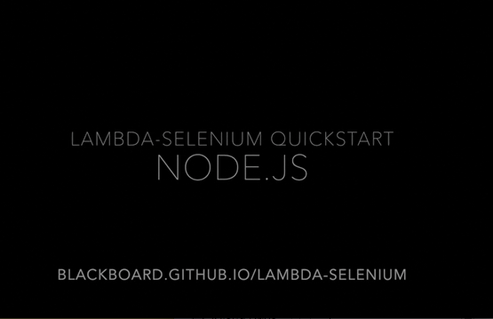

# Lambda-Selenium: NodeJS Tutorial 

#### Running The Example
1. [Download the latest release  - node_lambda_function.zip](https://github.com/blackboard/lambda-selenium/releases/latest)
2. Create new function in AWS console
3. Upload zip file and configure options
4. Execute!

